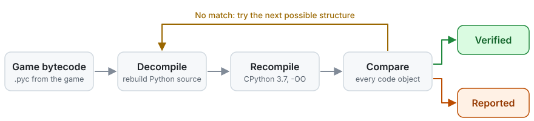

<p align="center">
  <picture>
    <source media="(prefers-color-scheme: dark)" srcset="docs/logo-dark.svg">
    
  </picture>
</p>

<p align="center">
  <a href="https://github.com/BigBadBleuCheese/Motherlode/actions/workflows/tests.yml"></a>
  <a href="#results"></a>
  
  
  
  <a href="LICENSE"></a>
</p>

The game ships its simulation code as compiled Python 3.7 bytecode inside a handful of `.zip` archives. Decompilers have been turning that back into source for years, but they get some functions wrong, and when they do, nothing tells you: the output compiles, it reads fine, and it behaves differently from the game.

Motherlode closes that gap. After decompiling a file, it compiles the result with the same compiler and settings the game uses and compares every function's bytecode with the game's, instruction by instruction. A function that matches is proven to be the game's code. A function that doesn't is listed in the report, so you know exactly what not to trust.

## Results

Measured on the full game install (3,323 script files, 72,954 functions, classes, lambdas and comprehensions):

| Archive | Files | Fully verified files | Code objects verified |
|---|---:|---:|---:|
| `simulation.zip` | 2,724 | 99.27% | 99.95% |
| `core.zip` | 121 | 98.35% | 99.93% |
| `generated.zip` | 58 | 100.00% | 100.00% |
| `base.zip` (EA's copy of the standard library) | 420 | 97.62% | 99.85% |
| **All** | **3,323** | **99.04%** | **99.93%** |

For comparison, the same check applied to decompyle3 3.9.3 on the game's own code (everything except `base.zip`) verifies 52.4% of files and 72.6% of code objects. Another 7.6% of its code objects compile but don't match, and those include real logic errors, such as `sims4.commands` code that returns `None` where the game returns `True`.

A full install decompiles in about a minute and a half on two cores.

## Quick start

**Windows:** download this repository (**Code > Download ZIP** on GitHub), unzip it anywhere, and double-click `Motherlode.cmd`. It decompiles into a `decompiled` folder next to the launcher.

**macOS:** open Terminal and paste:

```
/bin/bash -c "$(curl -fsSL https://raw.githubusercontent.com/BigBadBleuCheese/Motherlode/master/tools/macos.sh)"
```

That downloads the latest Motherlode into `~/Library/Application Support/Motherlode` and decompiles into `~/Documents/Motherlode`. Run the same command again after a game patch; it updates Motherlode too.

Downloading the ZIP and double-clicking `Motherlode.command` doesn't work on current macOS. Gatekeeper blocks scripts downloaded through a browser, and on macOS 15 and later right-click > **Open** no longer gets past it. If you already have the ZIP, run `bash Motherlode.command` from that folder in Terminal instead, or allow it once under **System Settings > Privacy & Security > Open Anyway**.

Either way, Motherlode finds The Sims 4 on your computer, decompiles it, and opens the output folder when it's done.

It looks where the EA app, Origin and Steam install the game (including Steam libraries on other drives), and on Windows it also checks the install location EA records in the registry. If your copy is somewhere else, drag the game folder onto `Motherlode.cmd` on Windows, or on a Mac run `bash Motherlode.command "/path/to/The Sims 4.app"` from the Motherlode folder. The same works for a `.ts4script` file, to decompile a script mod; its files go in a folder named after the mod.

### Python 3.7

Motherlode runs on Python 3.7, the version the game itself uses, because it checks its work with that exact compiler. If you build script mods you already have it.

- **Windows:** if Python 3.7 isn't installed, `Motherlode.cmd` downloads a private copy of Python 3.7.9 published by the Python Software Foundation on nuget.org, checks it against a pinned SHA-256 checksum, and keeps it in `%LOCALAPPDATA%\Motherlode`. Nothing is installed system-wide.
- **macOS:** if Python 3.7 isn't installed, `Motherlode.command` offers to download the official Python 3.7.9 installer from python.org. It confirms the installer is signed by the Python Software Foundation, then opens it. On Apple silicon Macs, macOS will offer to install Rosetta the first time Python runs.

## What you get

```
decompiled/
    scripts/       the game's scripts, one .py per module, laid out as the game imports them
    stdlib/        EA's copy of the Python standard library
    stubs/         .pyi stubs for engine modules built into the game executable
    motherlode-report.txt
    motherlode-report.json
    pyrightconfig.json, .vscode/, .idea/, ts4-python.iml
```

`scripts` merges the game's `core`, `simulation` and `generated` archives. They never contain the same file or folder, and the game puts all three on its import path, so `import sims4.log` and `from buffs.buff import Buff` resolve here the same way they do in the game.

`motherlode-report.txt` lists every function that did not verify, by file, and `motherlode-report.json` has the same information for tools.

### Code completion in PyCharm and VS Code

Open the `decompiled` folder as a project. It comes configured:

- **VS Code** (Pylance) and other Pyright-based editors read `pyrightconfig.json`, which sets Python 3.7, makes `scripts` the import root and points at the stubs.
- **PyCharm** reads `.idea/` and `ts4-python.iml`, which mark `scripts` and `stubs` as source roots. Choose any Python 3.7 interpreter when PyCharm asks.

The game's scripts import about 40 modules that exist only inside the game executable, such as `_math`, `_resourceman` and `_sims4_collections`. Motherlode writes a stub for each one, listing the names the scripts use from it, so those imports resolve and the names show up in completion. It also writes stubs for the protocol buffer modules the scripts import by their short names. On the current game, this takes Pyright from 301 unresolved-import warnings down to 15, all for debugging tools the shipped game never loads.

To get the same completion in your own mod project, add the `decompiled/scripts` folder and the `decompiled/stubs` folder to it:

- **VS Code:** set `"python.analysis.extraPaths": ["<path>/decompiled/scripts"]` and `"python.analysis.stubPath": "<path>/decompiled/stubs"` in your project's `.vscode/settings.json`.
- **PyCharm:** under **Settings > Project > Project Structure**, add `decompiled` as a content root, then mark `scripts` and `stubs` as **Sources**.

### Command line

```
py -3.7 -m pip install git+https://github.com/BigBadBleuCheese/Motherlode
motherlode
```

With no arguments, `motherlode` decompiles the installed game into `./decompiled`. You can also run it from a clone without installing (`py -3.7 -m motherlode`). Other options:

- Inputs: a game folder or `The Sims 4.app`, script archives (`.zip` or `.ts4script`), folders of `.pyc` files, or single `.pyc` files.
- `-o FOLDER` sets the output folder.
- `-j N` sets the number of worker processes (default: one less than your CPU count).
- `--list-installs` prints the installs Motherlode can find and exits.
- `--open` opens the output folder when finished.
- `--no-search` skips the retry pass described below, which is faster but verifies slightly less.

Rerunning into the same folder replaces the `scripts`, `stdlib` and `stubs` folders from the previous run, so files a patch removed don't linger. Motherlode only does this in folders that hold one of its reports.

## How it works

<p align="center">
  <picture>
    <source media="(prefers-color-scheme: dark)" srcset="docs/how-it-works-dark.svg">
    
  </picture>
</p>

Most decompilers match bytecode against a grammar of known patterns. When the compiler's optimizer rearranges jumps in a way the grammar doesn't expect, they either give up or quietly pick the wrong structure. The classic example in the game's code is `if a and b: return x` followed by `return y`, which a grammar-based decompiler can nest the wrong way, so the function returns `None` when `a` is false.

Motherlode targets exactly one compiler: CPython 3.7 with `-OO`, the way EA builds the game. It reconstructs loops and `try`/`with` blocks from the explicit block markers 3.7 emits, rebuilds `if` statements and `and`/`or` chains by inverting what the 3.7 compiler does with conditions, and accounts for the optimizer's jump threading and dead-code rules. When a function could have come from more than one structure, the result is compiled and checked; if it doesn't match, Motherlode retries the alternatives and keeps the one that does.

Two verdicts count as verified:

- **exact**: the bytecode is identical.
- **equivalent**: the instructions and control flow are identical, and the only difference is unreachable code or jump layout. These functions behave identically.

### Line numbers

Statements are written on the same line numbers they occupy in EA's source files. Blank space shows up where comments and docstrings used to be. The upside is that line numbers in the game's exception logs point at the right line of the decompiled file.

## What can't be recovered

- **Comments, docstrings and `assert` statements.** The game is compiled with `-OO`, which removes docstrings and asserts from the bytecode entirely.
- **Formatting.** Names, constants and structure come back exactly. Quoting style, parentheses and line wrapping are Motherlode's own.
- **Some unreachable code.** Code after a `return` is partly removed by the compiler, so a few functions whose dead code was only half removed can't be reproduced exactly. They behave the same and are listed in the report.
- **Engine modules.** Modules like `_math` are part of the game executable, not Python, so there is no source to recover. The generated stubs stand in for them.

## Using it as a library

```python
from motherlode import decompile_pyc

result = decompile_pyc("buff.pyc")
print(result.source)
for f in result.unverified():
    print(f.status, f.path)
```

## Running the tests

```
py -3.7 -m unittest
```

Each test compiles a snippet the way the game does, decompiles it, and requires every code object to verify.

## A note on the game's code

Motherlode contains no game code. It works on the copy of the game you already have. The scripts it produces are EA's work, so use them the way the modding community always has: to understand the game and build mods for it.

## License

MIT
